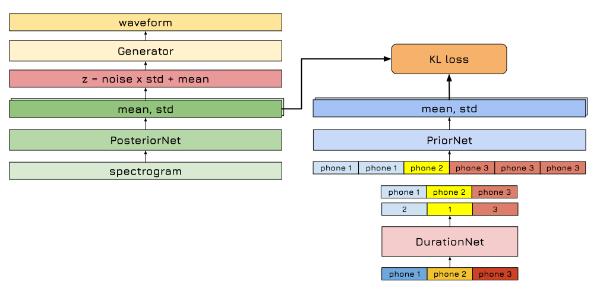

# Light Speed ⚡

Light Speed ⚡ is an open-source text-to-speech model based on VITS, with some modifications:
- utilizes phoneme duration's ground truth, obtained from an external forced aligner (such as Montreal Forced Aligner), to upsample phoneme information to frame-level information. The result is a more robust model, with a slight trade-off in speech quality.
- employs dilated convolution to expand the Wavenet Flow module's receptive field, enhancing its ability to capture long-range interactions.

<!--  -->

## Pretrained models and demos

We provide two pretrained models and demos:
- VN - Male voice: https://huggingface.co/spaces/ntt123/Vietnam-male-voice-TTS
- VN - Female voice: https://huggingface.co/spaces/ntt123/Vietnam-female-voice-TTS

## FAQ

Q: How do I train on custom dataset?  
A: See the `./prepare_audio_1_tfdata.ipynb` notebook for instructions on preparing the training data.

Q: How can I train the model with 1 GPU?  
A: Run: `python train.py --tfdata tfdata --rm-old-ckpt > logs/run.log`

Q: How can I train the model with specific GPU?
A: Run: `CUDA_VISIBLE_DEVICES=2,3 torchrun --standalone --nnodes=1 --nproc-per-node=2 train.py --tfdata tfdata --rm-old-ckpt --batch-size 16` 

Q: How can I train a model to predict phoneme durations?  
A: See the `./train_duration_model.ipynb` notebook.

Q: How can I generate speech with a trained model?  
A: See the `./inference.ipynb` notebook.


## Credits

- Most of the code in this repository is based on the [VITS official repository](https://github.com/jaywalnut310/vits).

## fix bug
- bug with mfa aligner
  use newer version of mfa see [here](https://montreal-forced-aligner.readthedocs.io/en/latest/installation.html)
- bug with vbx dataset
    install git lfs
    ```bash
    curl -s https://packagecloud.io/install/repositories/github/git-lfs/script.deb.sh | sudo bash sudo apt-get install git-lfs
    ```
- when train with custom dataset txt file and wav must be in the same folder
- need to train separate duration model when inference
- run mfa train -h to see how to config train ( it train on CPU don't know why)
- to view loss table with tensorboard
  - ctrl + shift + p -> python:Launch Tensorboard -> choose logs folder